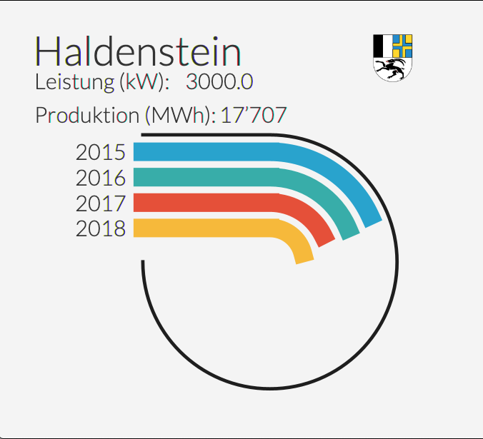

## CUIE Abschlussprojekt

Bitte Anleitung in [docs](./docs/implementation.md) beachten.

### Bearbeitet von

* _Florian Thiévent (lichtwellenreiter)_

### Integriert in die OOP2-Projekte von

* *_Ergänzen Sie hier welche OOP2-Teams Ihr Projekt erfolgreich integriert haben._*

### Abgabe

* *Mittwoch, 10.6.2020*, 20:42 Uhr

* Die Abgabe erfolgt durch ein "Push" auf den Master-Branch Ihres GitHub-Repositories.

### Initiale Schritte

* Tragen Sie ihren Namen unter "Bearbeitet von" ein.

* Benennen Sie das Package `lichtwellenreiter` um. Verwenden Sie Ihren GitHub-Account- oder Team-Namen. (Via `Refactor -> Rename…`)

* Pushen Sie diese Änderungen am besten sofort ins Git-Repository (z.B. via `VCS -> Commit… -> Commit & Push`)

### Abschliessende Schritte

* Tragen Sie die Namen der OOP2-Studierenden, die ihr Projekt erfolgreich integriert haben, unter "Integriert in die OOP2-Projekte von" ein

### Aufgabe: Dashboard oder Business Control für WindparksFX

Entwerfen und implementieren Sie entweder ein Dashboard oder ein Business Control für das OOP2-Projekt 'WindparksFX' auf Basis JavaFX.

Dashboard

* ein Dashboard ersetzt oder ergänzt den sogenannten Header der Windparks-Applikation
* es arbeitet auf mindestens 2 Attributen eines Windparks
* typischerweise enthält es also mehrere interaktive Custom Controls (im Sinne der Vorlesung)

Business Control

* Ein Business Control ersetzt eines (oder mehrere) der im sogenannten Editor-Bereich des OOP2-Projekt verwendeten Standard-TextFields.
* Das Business Control soll den Benutzer beim jeweiligen Arbeitsschritt optimal unterstützen und alle im Unterricht besprochenen Mindestanforderungen an ein Business-Control erfüllen.

Für die einzelnen CustomControls des Dashboards verwenden Sie bei der Implementierung die Struktur wie im package `template_simplecontrol`.

Für das _'Business Control'_ verwenden Sie bei der Implementierung die Struktur wie im package `template_businesscontrol`.

Es ist Bestandteil der Aufgabe das passende Template auszuwählen (und zu erkennen, falls ein Template nicht geeignet ist).

### Präsentation

* *Montag, 8.6.2020*, 19:45 Uhr, via MS Teams
* Die Projekte werden der OOP2-Klasse im Rahmen einer virtuellen *Poster-Session* präsentiert.
* Die Postersession startet mit Kurzpräsentationen (1 bis 2 Minuten) aller Projekte.
* Danach wird in projekt-spezifischen "Meetings" die Gelegenheit gegeben auf Detailfragen einzugehen.
* Erarbeiten Sie eine geeignete Präsentationsform, so dass das Interesse möglichst vieler OOP2-Teams an Ihrem Projekt geweckt wird.
* Organisieren Sie Integrationstermine mit den interessierten OOP2-Studierenden.
** Die Integration ist eine Gemeinschafts-Aufgabe von CUIE- und OOP2-Team.

### Bewertung

* Mit einer guten Präsentation Ihres implementierten und lauffähigen Projekts an der Postersession haben Sie normalerweise mindestens eine 4.0 erreicht.
* Durch eine gute Code-Qualität, d.h. insbesondere eine klare Struktur des Codes entsprechend der im Unterricht erarbeiteten Konzepte, können Sie eine 5.0 erreichen.
* Die Qualität aus Benutzersicht durch die Anzahl Integrationen in OOP2-Projekte. Jede Integration wird mit +0.25 bewertet, jedoch maximal mit +1.5.
* *Nicht genügend* ist es
** wenn Sie an der Postersession nicht oder überwiegend passiv teilnehmen.
** falls im vorgestellten Projekt keine der im Unterricht erarbeiteten Konzepte erkennbar sind
** das Projekt nicht compilierfähig ist
** falls es sich um ein Plagiat handelt
** falls kein nennenswerter Beitrag bei der Entwicklung geleistet wurde
** im Zweifelsfall wird ein Code-Walkthrough durchgeführt
* In Ausnahmefällen kann es dazu kommen, dass Teammitglieder unterschiedliche Noten erhalten.

### Bitte beachten Sie

* Falls Sie das Assignment zu zweit bearbeiten:
** tragen Sie beide Namen unter "Bearbeitet von" ein
** arbeiten Sie ausschliesslich in einem Repository
** falls sie beide Zugang zu diesem Repository wollen: tragen Sie die zweite Person als "Collaborator" ein (auf GitHub unter `Settings -> Manage access`)
** löschen Sie das nicht benötigte Repository (auf GitHub unter `Settings`)
** arbeiten Sie gemeinsam und gleichzeitig an den Aufgaben (Stichwort: Pair-Programming)
** https://www.it-agile.de/wissen/agiles-engineering/pair-programming/[Pair-Programming] heisst insbesondere, dass beide Teammitglieder zu gleichen Teilen aktiv in der Entwickler-Rolle sind. Einem Entwickler lediglich bei seiner Arbeit zuzuschauen ist kein Pair-Programming.
** das Aufteilen und separate Bearbeiten von Teil-Aufgaben ist nicht erwünscht
* Ausdrücklich erlaubt und erwünscht ist, dass Sie sich gegebenenfalls Hilfe holen.
Das Programmierzentrum ist geöffnet und Nachfragen werden zum Beispiel über den im Repository integrierten
Issue Tracker oder per Mail gerne beantwortet.
* Ab Montag, 8.6.2020, 22:00 Uhr, können leider (aus privaten, gesundheitlichen Gründen) keine Fragen mehr beantwortet werden.

### Bei Problemen mit dem IntelliJ-Setup

Es kommt immer wieder mal vor, dass der Setup des IntelliJ-Projekts nicht auf Anhieb funktioniert oder "plötzlich" nicht mehr funktioniert.

Sie brauchen in so einem Fall NICHT nochmal den Invitation-Link annehmen oder das Projekt via “Check out from Version Control” oder "git clone …" nochmal anlegen.

Statt dessen ist es am besten den IntelliJ-Setup neu generieren zu lassen. Dazu verwendet man den File `build.gradle`, der eine komplette und IDE-unabhängige Projektbeschreibung enthält.

Die einzelnen Schritte:

* Schliessen Sie alle geöffneten Projekte (`File -> Close Project`)
* Wählen Sie “OPEN”
* Es erscheint ein Finder-Fenster mit dem Sie zu ihrem Projekt navigieren.
* Dort wählen Sie den File `build.gradle` aus.
* Beim nächsten Dialog `Open as Project` wählen.
* In der "Project Structure" kontrollieren ob Java 13 ausgewählt ist (und dieser JDK JavaFX enthält).
* In den "Settings" ("Preferences" auf dem Mac) überprüfen, ob für Gradle als "Gradle JVM" der Project-SDK eingestellt ist.

Jetzt sollte der Projekt-Setup korrekt und die beiden `DemoStarter` ausführbar sein.
