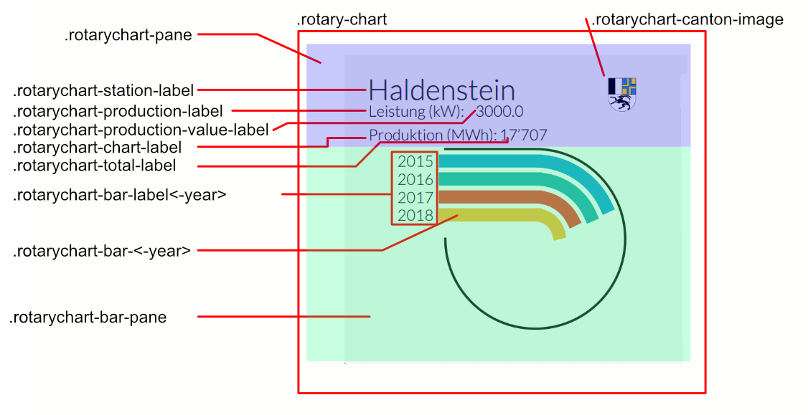

# Implementation of RotaryChart

## Basic implementation
1. Add the code from `cuie.lichtwellenreiter.dashboard` to your codebase
2. Instantiate `RotaryChart rotaryChart = new RotaryChart();`
3. Setup bindings (use your PresentationModel instead):
```java
rotaryChart.stationProperty().bind(pm.titleProperty());
rotaryChart.cantonProperty().bind(pm.cantonProperty());
rotaryChart.productionLabelProperty().bind(pm.installedPowerLabelProperty());
rotaryChart.productionProperty().bind(pm.installedPowerProperty());
rotaryChart.chartTitleProperty().bind(pm.chartLabelProperty());
rotaryChart.value2015Property().bind(pm.production2015Property());
rotaryChart.value2016Property().bind(pm.production2016Property());
rotaryChart.value2017Property().bind(pm.production2017Property());
rotaryChart.value2018Property().bind(pm.production2018Property());
```

## CSS Selectors
The label showed on hover has the css class: .rotarychart-bar-text<-year>

